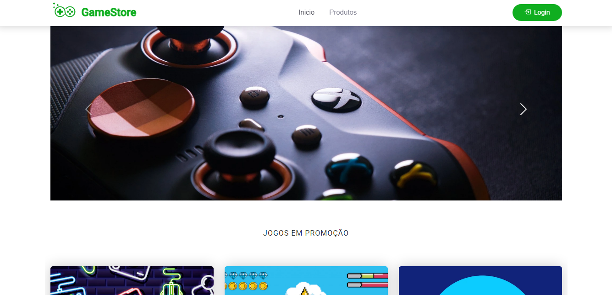

# E-commerce Project using Angular

This project is an e-commerce website developed using the Angular framework (version 15.0.4). The purpose of this project is to explore and implement various concepts in TypeScript and Angular, including the installation process, syntax differences between TypeScript and JavaScript, and object-oriented programming in TypeScript.

## Project Overview

The main objectives of this project include:

- Understanding TypeScript language structure:
  - Installation
  - Syntax
  - Differences between TypeScript and JavaScript
  - Object-Oriented Structure in TypeScript

- Implementing an e-commerce platform using Angular.
- Installing and integrating Bootstrap and Angular Material into the project.
- Creating a complete webpage with essential components like a menu, content section, footer, and forms for user login and other elements of the homepage and login screen.

## Features

- **Angular**: Developed with Angular version 15.0.4.
- **TypeScript**: Utilizes TypeScript for a structured and scalable codebase.
- **Bootstrap**: Integrated for responsive design and layout.
- **Angular Material**: Used to create visually appealing components with ease.
- **Responsive Design**: The website is responsive and works across various devices.

## Project Setup

1. **Clone the Repository**: 
    ```bash
    git clone git@github.com:MateusjsSilva/ecommerce-angular.git
    cd game-store
    ```

2. **Install Dependencies**: 
    ```bash
    npm install
    ```

3. **Run the Project**: 
    ```bash
    ng serve
    ```
    Open your browser and navigate to `http://localhost:4200/`.

## Screenshots

<div align="center">
  
</div>

<div align="center">
  
</div>

## Contribution

Feel free to open issues or submit pull requests. All contributions are welcome!

## License

This project is licensed under the MIT License - see the [LICENSE](LICENSE) file for details.